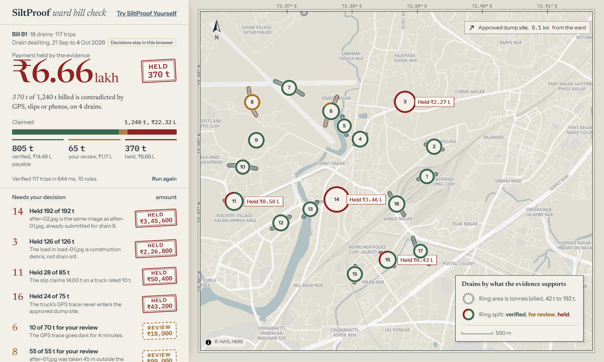
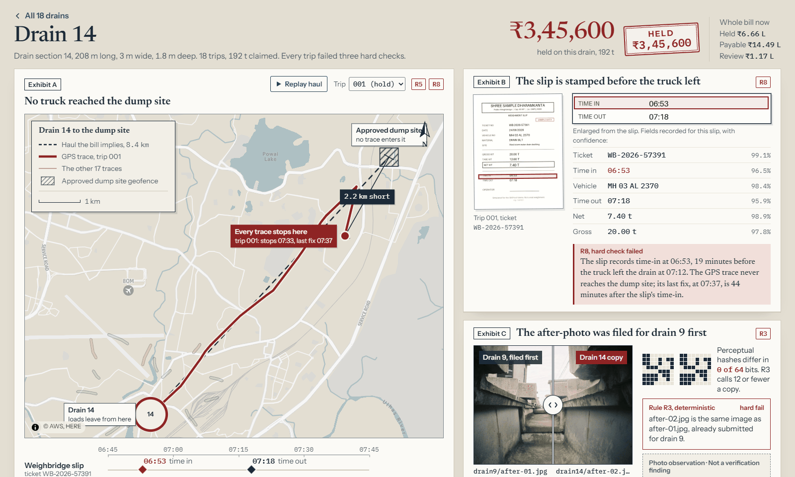
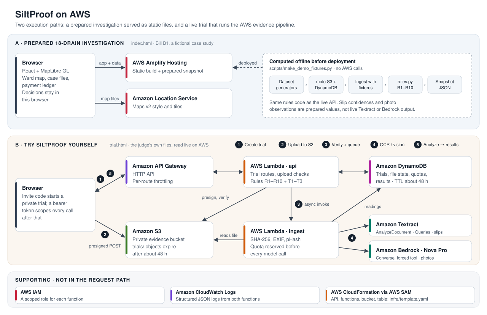
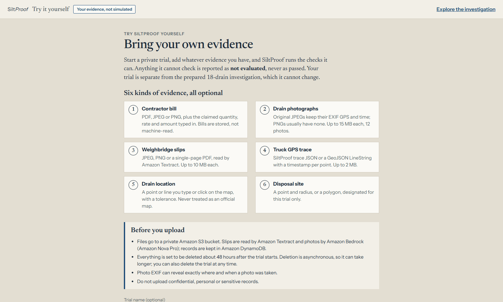

<h1 align="center">SiltProof</h1>

<p align="center"><strong>Evidence before expenditure.</strong></p>

<p align="center">
Drain desilting is easy to invoice and hard to verify. SiltProof cross-checks truck GPS traces,
weighbridge slips and site photographs against a contractor's bill, and shows the engineer
exactly which tonnes the evidence supports, which need a closer look, and which it contradicts,
before the payment is approved.
</p>

<p align="center">
<a href="https://main.d1o7ayjtge649w.amplifyapp.com"><strong>Open the live investigation</strong></a>
&nbsp;·&nbsp;
<a href="https://main.d1o7ayjtge649w.amplifyapp.com/trial.html"><strong>Try it with your own evidence</strong></a>
&nbsp;·&nbsp;
<a href="docs/ARCHITECTURE.md">Architecture</a>
</p>

<p align="center"><sub>Built for AWS Environmental Hacks 2026 · Runs on AWS in ap-south-1 (Mumbai)</sub></p>



## Why this matters

Before every monsoon, Indian cities pay contractors to clear silt from their
storm-water drains. Drains that are paid for but never properly cleared carry
less water when the rain arrives, and urban flooding is often a drainage problem
before it is a rainfall problem.

The work is usually billed by the tonne or by the truckload, and the proof
arrives in pieces: before and after photographs from the site, a weighbridge
slip for every truck, and a GPS log from the vehicle. Each document can look
reasonable on its own. Many problems only show up when they are put side by
side: a slip stamped before the truck left, a route that stops short of the
disposal site, the same photograph filed for two drains.

A ward engineer approving one bill may face 18 drain sections, more than a
hundred trips, and a few weeks before the rains. Checking every slip against
every trace by hand is not realistic, and a single photo or document cannot
show on its own that the silt was removed.

SiltProof does that cross-checking. It reads the evidence, applies ten
explicit rules across the sources, and turns each contradiction into a finding
the engineer can see, a tonnage and an amount. The engineer still makes the
payment decision.

## What makes it different

| A typical tool | SiltProof |
|---|---|
| Plots drains and flood risk on a map | Checks whether the drain work being paid for is supported by the evidence |
| Reads each document on its own | Cross-checks photos, slips and GPS against each other and against the bill |
| Produces an opaque AI risk score | Names the rule, the evidence and the measurement behind every finding |
| Flags the whole bill as suspicious | Splits the bill into verified, review and held tonnes, with the rupee amount for each |
| Decides on the contractor's behalf | Leaves approval to an accountable engineer, who sees the evidence first |

AI reads the documents. Deterministic rules judge them. A person decides.

## How it works

1. **Collect.** Photographs, weighbridge slips and truck GPS traces arrive with
   the contractor's claim of trips and tonnes.
2. **Extract.** Amazon Textract reads each slip with targeted queries (ticket,
   vehicle, weights, times). Amazon Bedrock running Amazon Nova Pro looks at
   each photo and returns a structured verdict: is the channel cleared, is the
   load silt or construction debris. Photo EXIF and a perceptual hash are read
   in code. This happens once, when a file arrives.
3. **Cross-check.** Ten deterministic rules compare the sources: photo location
   and time against the drain and the work window, slip time against GPS
   arrival, slip weight against truck capacity, route against the disposal
   site, the tonnage claimed against the drain's dimensions.
4. **Explain.** Every trip is `VERIFIED`, `REVIEW` or `HOLD`, every drain green,
   amber or red, and every finding carries its rule, message and evidence: the
   two photos side by side, the slip field and its OCR confidence, the GPS trace
   replayed on the map.
5. **Decide.** The engineer approves or holds each flagged drain. The ledger
   shows what is payable, what is pending review and what is held.

SiltProof has two execution paths:

- **The prepared investigation** is a bill (Bill B1) analysed before
  deployment and served as static files. It shows the full experience at the
  scale of a real bill, instantly and at no cost per visit.
- **Try SiltProof Yourself** runs the live pipeline on AWS against files you
  upload: Amazon S3, AWS Lambda, Amazon Textract, Amazon Bedrock and Amazon
  DynamoDB.

## Investigation spotlight: Bill B1

One ward, one contractor bill, 21 Sep to 4 Oct 2026, at an illustrative
₹1,800 per tonne. The bill and its evidence are a prepared case study.

|  | Tonnes | Amount |
|---|---:|---:|
| Claimed: 18 drains, 117 truck trips | 1,240 t | ₹22.32 lakh |
| Verified, payable | 805 t | ₹14.49 lakh |
| Needs the engineer's review | 65 t | ₹1.17 lakh |
| **Held: contradicted by the evidence** | **370 t** | **₹6.66 lakh** |

Twelve drains are clean. Four are red:

- **Drain 3:** the load photo shows construction debris, not silt (R4).
- **Drain 11:** two slips claim 14 t on a truck rated for 10 t (R7).
- **Drain 14:** three independent contradictions, below.
- **Drain 16:** one trace never reaches the dump site (R5), and one truck is
  logged on two trips it could not physically make (R6).

Two drains are amber, for review: on drain 6 a GPS trace goes dark for four
minutes, and a drain 8 photo was taken 45 m from the drain, within the margin
of a consumer GPS fix. If the engineer approves both review drains, verified
rises to 870 t and ₹6.66 lakh stays held.

### Drain 14: three independent contradictions



Drain 14 claims 18 trips and 192 t. Every trip fails three hard rules, so all
₹3,45,600 is held:

- **R3, a reused photograph.** The after-photo is the same image already filed
  for drain 9: their perceptual hashes differ in 0 of 64 bits, where R3 treats
  12 or fewer as a copy.
- **R5, the route never arrives.** Every GPS trace stops about 2.2 km short of
  the approved dump site. *Replay haul* animates the truck's recorded route
  against the haul the bill implies.
- **R8, the slip predates the trip.** Trip 001's slip records time-in at 06:53,
  19 minutes before the truck left the drain at 07:12.

Any one of these could be a clerical error or a faulty device. Three
independent sources contradicting the claim at once is a reason to hold
payment and ask questions. SiltProof does not decide whether it is fraud; it
shows the engineer the evidence and the amount at stake.

## AWS architecture



In the live trial, the browser uploads straight to a private S3 bucket through
a presigned POST. The api function checks each file, then invokes the ingest
function asynchronously. Ingest calls Textract for slips and Bedrock for photos,
once per file, after reserving the call against a quota. `/analyze` then runs
only deterministic code. The full flow, limits and data model are in
[`docs/ARCHITECTURE.md`](docs/ARCHITECTURE.md). A simplified diagram for slides
is in [`docs/images/aws-architecture-simple.svg`](docs/images/aws-architecture-simple.svg).

| Service | Role in SiltProof | Used by |
|---|---|---|
| AWS Amplify Hosting | Hosts the investigation and the trial page as a static build | Both |
| Amazon Location Service | Maps v2 Monochrome Light style and tiles, through a browser API key limited to map actions and the site's referrers | Both |
| Amazon API Gateway | HTTP API with per-route throttling | Trial |
| AWS Lambda | `api`: routes, upload checks, the rules. `ingest`: EXIF, perceptual hash, Textract and Bedrock calls. Python 3.12 on arm64 | Trial |
| Amazon S3 | Private evidence bucket; trial files expire after about 48 hours | Trial |
| Amazon Textract | `AnalyzeDocument` with Queries reads each weighbridge slip | Trial |
| Amazon Bedrock | Amazon Nova Pro (`apac.amazon.nova-pro-v1:0`) gives a structured photo verdict through a forced tool call | Trial |
| Amazon DynamoDB | Trials, evidence state, readings, quotas and results, with TTL | Trial |
| AWS IAM | Per-function roles scoped by SAM policy templates | Supporting |
| Amazon CloudWatch Logs | Structured JSON logs from both functions | Supporting |
| AWS CloudFormation (AWS SAM) | The backend stack: [`infra/template.yaml`](infra/template.yaml) | Supporting |

The prepared investigation calls no Lambda function, Textract or Bedrock. Its
results were computed before deployment by the same rules code, and the AWS
CLI and SDK (boto3) are developer tooling only.

## The rules

All ten rules live in [`backend/common/rules.py`](backend/common/rules.py) as
pure functions. A **hard** finding puts the trip on `HOLD`; a **soft** finding
sends it to `REVIEW`. Photo rules and R10 judge the drain's own evidence, so
their findings apply to every trip billed against that drain.

| Rule | Checks | Hard (hold) | Soft (review) |
|---|---|---|---|
| R1 | Photo GPS against the drain's 30 m geofence | More than 60 m from the drain | 30–60 m away, or no GPS |
| R2 | Photo time against the bill's work window | Outside the window | No timestamp |
| R3 | Photo reuse, by perceptual hash | Within 12 of 64 bits of an earlier photo on the bill | |
| R4 | What the vision model saw | Load is construction debris | Load unclear, after-photo not cleared, or not assessed |
| R5 | GPS trace against the approved dump site | Never enters the dump site | |
| R6 | Consecutive trips by one truck | Needs more than 40 km/h, or overlaps | |
| R7 | Slip net weight against truck capacity | Over capacity | Net weight unreadable |
| R8 | Slip time-in against GPS arrival | More than 10 minutes apart | Time unreadable, or no arrival to compare |
| R9 | Slip vehicle number against the trip's truck | Different vehicle | Number unreadable |
| R10 | Drain total against length × width × depth × 1.4 t/m³ × 1.2 | | Claim exceeds the ceiling |

A GPS trace that goes dark for more than three minutes is a soft flag. Missing
or unreadable evidence (no slip, no trace, no photos, a file that failed to
read) raises its own soft finding: it is never treated as fraud, and never as
a pass.

The live trial uses the same thresholds through an adapter that first checks
each rule's inputs. With partial evidence a check reports `NOT_EVALUATED` and
names what is missing, or `INCONCLUSIVE` when the evidence cannot decide it.
It never reports a pass it could not test. The trial adds three arithmetic
checks: claim quantity × rate = amount (T1), gross − tare = net (T2), and
whether the slips account for the claimed quantity (T3).

No rule proves fraud. Each one records a contradiction, with its evidence, for
a person to weigh.

## Try SiltProof Yourself

**[main.d1o7ayjtge649w.amplifyapp.com/trial.html](https://main.d1o7ayjtge649w.amplifyapp.com/trial.html)**

This is the live AWS pipeline, on your own files. Upload a drain photograph
and a weighbridge slip, and add a GPS trace, a drain location, a disposal site
and the claimed quantity if you have them. The photo is read by Amazon Bedrock
(Nova Pro) and the slip by Amazon Textract as soon as each upload completes.
Then the rules run, and every check shows its status and its evidence. The
result also names the model or service behind each reading.



- **Access.** Starting a trial needs an invite code. Judges receive it with the
  submission instructions. Each trial then has its own access token, kept in
  that browser tab.
- **Uploads.** Files go directly to a private S3 bucket through a short-lived
  presigned POST, bound to the declared type and size. The API re-checks size,
  type and file signature before any processing.
- **Real processing.** Slips (JPEG, PNG or a single-page PDF) are read by
  Textract `AnalyzeDocument` with Queries. Photos (JPEG or PNG) keep their EXIF
  GPS and time, and are assessed by Nova Pro. Large phone photos are sent as a
  downscaled copy; the original is never modified.
- **Safeguards.** Model calls are capped per trial and per day, reserved before
  they are made, and never repeated for the same file. Everything is set to be
  deleted about 48 hours after the trial starts, or at once with *Delete
  trial*.
- **Separation.** A trial cannot read or change the prepared investigation.

Please don't upload confidential or personal records: photo EXIF can reveal
where and when a picture was taken.

## Run it locally

Everything below runs offline. No AWS account is needed for the app or the
tests.

**Frontend** (Node 24 is what the team used):

```bash
cd frontend
npm ci
npm run dev        # http://localhost:5173
```

With no `VITE_API_BASE_URL` the app runs on the committed snapshot in
`frontend/public/data/demo`. With no Amazon Location key it draws a bundled
basemap. Useful URLs: `/?state=verified` opens the verified overview and
`/?state=verified&drain=14` opens drain 14's case file.

**Backend tests** (Python 3.12 or later):

```bash
python -m venv .venv
source .venv/bin/activate          # Windows: .venv\Scripts\activate
pip install -r requirements-dev.txt
python -m pytest                   # moto + MOCK_AWS=1, no AWS calls
```

**Frontend checks:**

```bash
cd frontend
npm test           # vitest + jsdom
npm run lint
npm run build      # tsc -b && vite build
```

Last full run, 10 Oct 2026: 472 backend tests and 114 frontend tests passed.

**The trial, offline:**

```bash
python scripts/trial_dev_server.py                       # API on :3001, moto for S3 and DynamoDB
cd frontend && VITE_API_BASE_URL=http://127.0.0.1:3001 npm run dev
# open http://localhost:5173/trial.html
```

Textract and Bedrock answer from fixtures labelled `OFFLINE MOCK`, and the
results say so.

**Regenerating the prepared case:** `python scripts/make_demo_fixtures.py`
rebuilds the snapshot through the real pipeline in memory. It restores the
generated stand-in photographs; re-apply the licensed ones as described in
[`docs/PHOTO-REPLACEMENT.md`](docs/PHOTO-REPLACEMENT.md).

### Frontend configuration

| Variable | Purpose |
|---|---|
| `VITE_API_BASE_URL` | The deployed API (`ApiUrl` stack output). The trial page needs it |
| `VITE_BILL_SOURCE` | `snapshot` (the prepared investigation) or `api` (a bill seeded into AWS) |
| `VITE_AWS_REGION`, `VITE_LOCATION_API_KEY` | Amazon Location basemap; leave the key empty for the offline map |
| `VITE_LOCATION_MAP_STYLE`, `VITE_LOCATION_COLOR_SCHEME` | Maps v2 style, `Monochrome` and `Light` by default |

Copy `frontend/.env.example` to `frontend/.env`, which git ignores. Never put an
AWS credential or the trial invite code in a `VITE_` variable: they are
compiled into public JavaScript.

### Deploying your own stack (optional, billable)

This needs your own AWS account and credentials, Bedrock model access to
Amazon Nova Pro in your region, and an Amazon Location API key. The trial stays
closed until you set an invite code.

```bash
python scripts/check_region.py ap-south-1          # one tiny Bedrock, Textract and Location call
sam build --use-container --template infra/template.yaml
sam deploy --guided --template infra/template.yaml
```

See [`docs/amazon-location.md`](docs/amazon-location.md) for the map key and
[`docs/LAUNCH-RUNBOOK.md`](docs/LAUNCH-RUNBOOK.md) for how the live site was
deployed and checked. Scripts that can reach AWS (`data/seed.py`,
`data/reset.py`, `data/gen_trips.py`) do nothing billable without `--live`.

## Repository layout

```
infra/          AWS SAM template: API, two functions, bucket, table
backend/
  api/          HTTP API: bill and drain routes, trial routes
  ingest/       Evidence extraction: EXIF, pHash, Textract, Bedrock
  trial/        Trial validation, processing, quotas and the rule adapter
  common/       rules.py (R1–R10), AWS providers, storage, geodesy, fixtures
frontend/
  src/          React 19 + MapLibre GL: the investigation and the trial
  public/data/  The prepared snapshot: 18 drains, 117 slips, 40 photos
data/           Dataset generators, photo import and provenance records
scripts/        Snapshot builder, offline trial server, live smoke tests
tests/          Offline pytest suite (moto, MOCK_AWS=1)
docs/           Architecture, trial API, Amazon Location, runbook, photo credits
design/         Design system and early prototypes
```

## Evidence provenance and limitations

Real contractor bills and their evidence are not public, so the 18-drain
investigation is a prepared case study:

- Bill B1 is synthetic. Drain locations, truck GPS traces, trip records, weighbridge slips and their confidence scores are prepared case-study data.
- The 40 photographs are licensed illustrative images (CC0 1.0 and the Pexels License), not field captures from these locations. The GPS and time attached to each photo, and its observation note, are prepared records.
- **The rules and the totals are real.** The verdicts, tonnages and amounts come from running the actual rules code over that evidence.
- **The live trial is separate.** Files uploaded there are processed by Textract and Bedrock on AWS, and its results say which service produced each reading.

The method is described further in [`docs/ARCHITECTURE.md`](docs/ARCHITECTURE.md) and [`DECISIONS.md`](DECISIONS.md).

## Security notes

- The browser holds no AWS credentials. The map uses an Amazon Location API key
  limited to map actions, restricted to the site's referrers, and set to expire.
- The trial invite code is a stack parameter that is never echoed and never
  part of the frontend bundle. Trial access tokens are stored only as SHA-256
  hashes.
- The evidence bucket blocks all public access. On the public deployment, the
  bill routes that write to the shared bill, issue upload links or refresh a
  summary answer 403 unless an operator enables them.
- API throttles and daily quotas bound cost; they are not authentication.

## Team

- **Somsubhra Nandi** ([@Somsubhra-Nandi](https://github.com/Somsubhra-Nandi)):
  the overall architecture and SAM infrastructure, the evidence ingestion
  pipeline (EXIF, perceptual hashing, Textract, Bedrock), verification rules
  R1–R10 and the API, the dataset generators and the prepared case, the
  investigation interface and its Amazon Location map, integrating and
  hardening the judge trial for launch, and the AWS deployment.
- **[@Subhra-Nandi](https://github.com/Subhra-Nandi)**: Try SiltProof Yourself,
  including the trial API contract, the isolated trial backend (scoped uploads,
  processing and checks), its routes, storage lifetime and throttling in the
  SAM template, its tests, the trial screens, and the offline trial server
  and browser check.

## Licence and attribution

This repository does not yet include a software licence file. The live map is
© AWS, HERE through Amazon Location Service. The offline fallback basemap uses
road and water data © OpenStreetMap contributors, ODbL.
