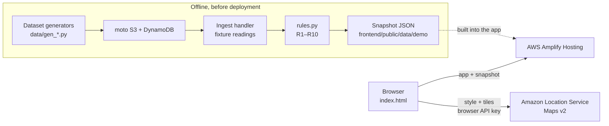
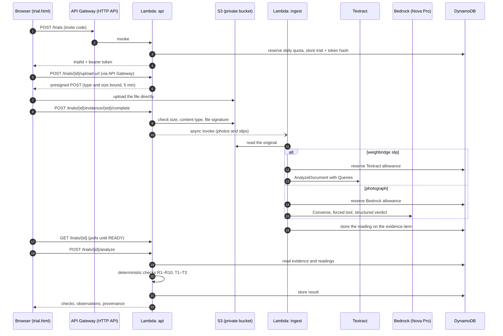

# SiltProof architecture

SiltProof has two execution paths that share one rules engine:

- **A. The prepared 18-drain investigation** (`index.html`) is a static React app
  on AWS Amplify Hosting. Its results were computed offline, before deployment,
  by running the same pipeline and rules code against a fictional bill. Browsing
  it calls no Lambda function, Textract or Bedrock.
- **B. Try SiltProof Yourself** (`trial.html`) runs the live pipeline on AWS:
  a judge's own photos and weighbridge slips are uploaded to Amazon S3, read by
  Amazon Textract and Amazon Bedrock (Amazon Nova Pro), and checked by the
  deterministic rules in AWS Lambda.

The backend (API, both functions, the bucket and the table) is defined in
[`infra/template.yaml`](../infra/template.yaml) (AWS SAM), region `ap-south-1`.
The Amplify app and the Amazon Location API key were created separately; see
[`LAUNCH-RUNBOOK.md`](LAUNCH-RUNBOOK.md) and [`amazon-location.md`](amazon-location.md).

A simplified version for slides and video:
[`images/aws-architecture-simple.svg`](images/aws-architecture-simple.svg).

## Path A: the prepared investigation

- `scripts/make_demo_fixtures.py` runs the generators, a moto S3 and DynamoDB,
  the real ingest handler with `MOCK_AWS=1`, and the real `POST /verify`, then
  saves the API's responses as the snapshot. No AWS call is made.
- The 117 slip images are generated; their field values and confidences are
  prepared fixture readings. The 40 photographs are licensed illustrative
  images (see [`PHOTO-CREDITS.md`](PHOTO-CREDITS.md)); their GPS, time and
  model observations are prepared records.
- The frontend is built with `VITE_BILL_SOURCE=snapshot`, so the investigation
  never calls the API. An engineer's approve and hold decisions are applied in
  the browser with the same arithmetic as `rules.apply_decision`, and are not
  sent anywhere.
- The map is MapLibre GL rendering Amazon Location's Monochrome Light style.
  If the style cannot load, the app falls back to a bundled basemap built from
  OpenStreetMap roads and water.

## Path B: Try SiltProof Yourself

What the code enforces, in order:

1. **Access.** `POST /trials` needs the invite code, a `NoEcho` stack
   parameter that is never in the frontend bundle; without it configured,
   trials are closed. Every later call needs the trial's bearer token, which
   DynamoDB stores only as a SHA-256 hash. A wrong token and an unknown trial
   get the same 404.
2. **Upload.** The browser posts straight to S3 under `trials/{trialId}/`, with
   a presigned POST bound to the registered content type and size. `/complete`
   re-checks size, type and the file's magic bytes before anything is
   processed. Traces are validated and summarised inside the api function; bill
   documents are stored, not read.
3. **Processing.** Photos and slips go to the ingest function by asynchronous
   invoke. A photo is hashed (SHA-256), its EXIF read and its perceptual hash
   computed; a downscaled processing copy is written beside the original only
   when Bedrock's input limits require it. Each billable call is reserved
   against per-trial and daily allowances in DynamoDB before it is made, and a
   file whose bytes were already read is never sent again.
4. **Analysis.** `/analyze` runs only deterministic code in the api function.
   No model is called at this step. Checks whose inputs are absent report
   `NOT_EVALUATED`; undecidable ones report `INCONCLUSIVE`.
5. **Retention.** Trial objects expire through an S3 lifecycle rule and trial
   records through DynamoDB TTL, about 48 hours after creation (both delete
   asynchronously). `DELETE /trials/{id}` removes everything at once.

### Limits

| | Default |
|---|---|
| Files per trial | 24, 120 MB in total |
| Photos | JPEG or PNG, up to 15 MB, 12 per trial |
| Weighbridge slips | JPEG, PNG or single-page PDF, up to 10 MB, 6 per trial |
| GPS traces | SiltProof JSON or GeoJSON LineString, up to 2 MB, 4 per trial |
| Model calls per trial | 15 Bedrock, 8 Textract; 30 analyses |
| Daily, across all trials | 60 new trials, 200 Bedrock calls, 100 Textract calls |
| API throttling | Stage-wide per route, e.g. `POST /trials` 1 request/s |

The daily and per-trial allowances fail closed. Throttles bound cost; they are
not authentication.

## The Bill B1 ingest path

The template also wires S3 `ObjectCreated` events on the `photos/`, `slips/`
and `traces/` prefixes to the ingest function. That path is for seeding a bill
into AWS (`data/seed.py --live`) and serving it from the API
(`VITE_BILL_SOURCE=api`). The public site does not use it: it serves the
prepared snapshot. The B1 routes that write or spend (`POST /verify`,
`POST /decision`, `POST /upload-url`, a summary refresh) answer 403 unless the
`B1OperatorRoutes` parameter enables them.

## Services

| Service | What it does here |
|---|---|
| AWS Amplify Hosting | Serves both pages as a static build, deployed manually from a built bundle |
| Amazon Location Service | Maps v2 style and tiles in the browser, through an API key limited to `geo-maps` actions and the site's referrers. `data/gen_trips.py --live` can route trucks with `CalculateRoutes`; the prepared case used the generator's offline interpolation |
| Amazon API Gateway | HTTP API, 17 routes, per-route throttling, CORS |
| AWS Lambda `api` | Python 3.12 on arm64. Trial and bill routes, upload validation, presigned URLs, the rules |
| AWS Lambda `ingest` | Python 3.12 on arm64, with a Pillow and imagehash layer. EXIF, perceptual hashes, Textract and Bedrock calls |
| Amazon S3 | One private evidence bucket, public access blocked, lifecycle expiry on `trials/` |
| Amazon Textract | `AnalyzeDocument` with Queries for ticket, vehicle, gross, tare, net, time in, time out and site |
| Amazon Bedrock | Amazon Nova Pro through the `apac.amazon.nova-pro-v1:0` inference profile. `Converse` with a forced tool returns a structured photo verdict: channel cleared, load type, confidence, notes |
| Amazon DynamoDB | One on-demand table, `pk`/`sk`, with TTL on trial and quota items |
| AWS IAM | Function roles from SAM policy templates, scoped to the bucket, the table and the ingest function |
| Amazon CloudWatch Logs | One-line JSON logs from both functions, for Logs Insights |
| AWS CloudFormation (SAM) | The backend stack is `infra/template.yaml` |

### Data model

| Partition key | Sort key | Holds |
|---|---|---|
| `BILL#B1` | `META`, `DRAIN#…`, `TRIP#…#…` | The bill, its drains and trips |
| `EVID#{s3 key}` | | One photo, slip or trace reading for the bill |
| `DUMPSITE#…`, `VEHICLE#…` | | Reference data for R5 and R7 |
| `TRIAL#{id}` | `META`, `EVID#{id}`, `RESULT#LATEST` | A trial, its evidence and its latest result |
| `QUOTA#{day}` | | Daily allowance counters |

## Design decisions

- **AI at ingestion, rules at decision time.** Textract and Bedrock run once
  per file when it arrives. Verification is pure Python over stored readings,
  so it is fast, repeatable and testable offline.
- **Rules are pure functions** (`backend/common/rules.py`). The API assembles
  the context; the rules only judge it. The trial adapter
  (`backend/trial/analysis.py`) checks each rule's prerequisites first, so
  partial evidence produces `NOT_EVALUATED` rather than a false pass.
- **Missing evidence is never fraud and never a pass.** It raises its own
  soft finding and sends the trip to a person.
- **One table, two functions, no queues.** The scope of a single ward bill does
  not need Step Functions, SQS or microservices.

More detail: [`JUDGE-TRIAL-API.md`](JUDGE-TRIAL-API.md) (the trial contract),
[`amazon-location.md`](amazon-location.md) (maps and the API key),
[`LAUNCH-RUNBOOK.md`](LAUNCH-RUNBOOK.md) (the deployment record) and
[`../DECISIONS.md`](../DECISIONS.md).
